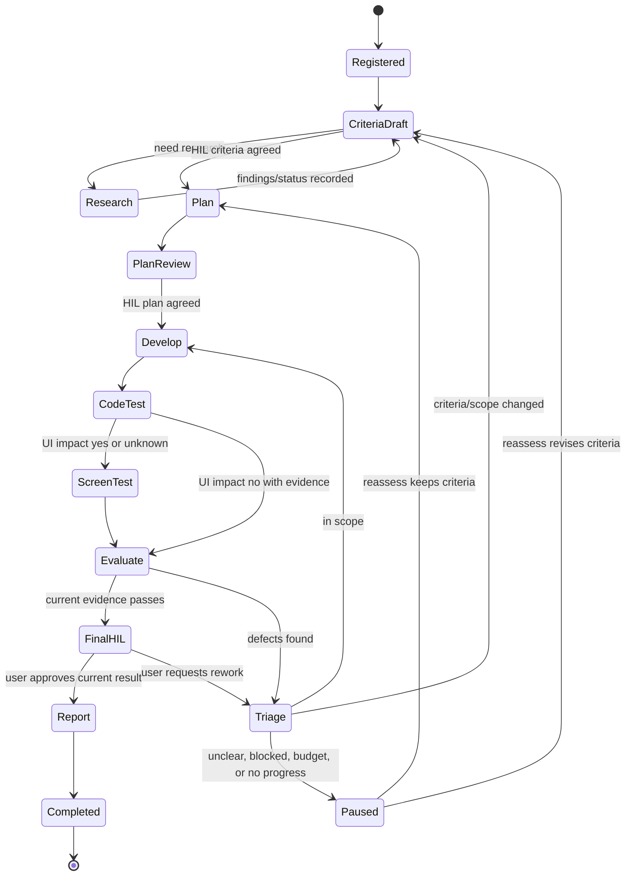

# task-orchestrator

This skill coordinates existing team skills as a stateful, task-local graph.
Choose the execution mode before dispatching work.

## v2 — enforced, adjustable policy

For enforced time/token/cost limits, authenticated HIL, circuit breakers or Step
Receipts, read `references/runtime-v2.md` and use `scripts/graph_runtime.py`.
Machine-readable stage payloads are in `scripts/runtime_contracts.py`.

- Coauthor the node/edge schemas, required objective validators, model/tool routes,
  UI impact and success conditions with the user before contract approval. Use
  `STAGE_SCHEMAS` as the starting point; explicitly agree any stage omission.
- UI impact yes/unknown requires code tests → screen interaction tests → visual
  review → evidence gate. A screenshot alone is not a passing screen test.
- Keep model choice in the approved route list: cheapest actually supported
  metered adapter for small low-risk work; capable adapter for complex/high-risk
  work. Missing metering/call limits or unavailable identity authority means
  `awaiting_data`; never substitute caller-reported zero or a free-text approval.
- All managed leader/research/development/test/model calls must pass the runtime's
  `before_tool_call` gate through registered trusted adapters. The existence of
  native hooks does not establish interception. This package installs no native
  model/identity adapter or global hook. Do not silently fall back to v1 or run
  unmanaged children when v2 enforcement is required.
- Defaults are in `runtime_policy.DEFAULTS`; apply per-workflow JSON overrides at
  creation. For later tuning use `request_tuning` and verified HIL approval. Record
  previous/new values and reason; preserve consumed time, usage, attempts and loops.
  Safety gates are not configurable off switches.
- Only delivered human-response waiting is excluded from execution clocks. The
  separate approval wall-clock expiry still defaults to deny. Never reset budgets
  on wait/resume or retry failed external effects with an unknown outcome.
- Resume from authoritative SQLite state and verified receipts. Emit the derived
  report with status, measurements, issues and evidence; do not claim an unsupported
  provider or visual test ran.

The remaining sections describe **v1 legacy/advisory mode only**. Use them for an
existing v1 task or an explicitly requested tracking-only task. v1 records events;
it does not enforce the v2 safety contract and is never an automatic fallback.

Design and user guide: `docs/skills/task-orchestrator.md`.
For exact event JSON, read `references/events.md`.
State CLI: resolve this skill's source directory first, then run
`scripts/task_state.py`; do not resolve the script path from the target repo cwd.

## Core Contract

- Store artifacts under `nimbalyst-local/tasks/TASK-####/`; IDs are local to the
  current workspace/task, not global.
- Use stable entity IDs (`AC-01`, `RES-01`, `DEV-01`, `TEST-01`, `ISSUE-01`) and
  increment attempts separately (`attempt-1`, `attempt-2`).
- `state.json` is the single source of truth. Mutations go through the state CLI
  with optimistic revision checks; do not dual-write a separate event log as truth.
- The state CLI requires POSIX file locking, Python 3.10+, and a Git worktree root.
  Ignored runtime inputs are caller-recorded evidence only; Git submodule entries
  are rejected.
- Coauthor acceptance criteria with the user. Record criteria version and human
  agreement; never fabricate approvals.
- If research is needed, call `research-team` in managed mode and attach its
  citation-backed output to the task state. Use separate finding and verifying
  children when available; do not let the finder self-verify. The leader dispatches
  child roles directly; children do not spawn their own teams.
- If implementation is needed, call `archon-adversarial-dev` in managed mode for
  bounded development work. Use an executor then an independent reviewer when
  available. The outer orchestrator owns retries and state. The leader dispatches
  child roles directly; children do not spawn their own teams.
- Call `test-agent-team` in managed mode for verification. If UI impact is yes or
  unknown, include an actual browser screen test with interaction and visual
  inspection. Unknown is not exempt. The leader dispatches test child roles directly;
  children do not spawn their own teams.
- Route clear, low-risk, small work to the cheapest actually supported model/agent
  available in the current environment; escalate after evidence of ambiguity,
  repeated failure, security risk, or complex reasoning need. Record actual routing
  when observable; mark cost/token data unknown if unavailable. The CLI records
  caller-supplied usage; it does not measure costs or enforce spend caps.
- If a legacy skill names fixed Claude/Codex roles that are unavailable, disclose the
  native-role substitution actually used; never imply cross-provider execution that
  did not happen.
- Completion requires: current criteria satisfied, required tests pass against the
  current code fingerprint, UI test passes when required, no blocking issues remain,
  user approval of the current result, and `report.md` saved.

## Graph



## State CLI

The CLI requires POSIX locking, Python 3.10+, and a Git worktree root workspace:

```bash
python3 .claude/skills/task-orchestrator/scripts/task_state.py init --workspace /repo --title "task title"
python3 .claude/skills/task-orchestrator/scripts/task_state.py show --task /repo/nimbalyst-local/tasks/TASK-0001
python3 .claude/skills/task-orchestrator/scripts/task_state.py snapshot --task /repo/nimbalyst-local/tasks/TASK-0001
python3 .claude/skills/task-orchestrator/scripts/task_state.py apply --task /repo/nimbalyst-local/tasks/TASK-0001 --expected REV --event /tmp/event.json
```

Supported event families: `criteria`, `approve`, `research`, `plan`, `start`,
`finish`, `check`, `issue`, `issue-reassign`, `rework`, `evaluate`, `pause`,
`complete`, `cancel`.
Exact JSON is documented in `references/events.md`.
`max_attempts` is the development attempt budget; `max_no_progress` is the stalled
same-result HIL threshold. There is no `resume` event.

## Stop Conditions

Pause for HIL only when criteria are unclear, scope changes, the same failure stops
progress, the budget/latency limit is reached, or final result approval is needed.
Otherwise keep the loop moving until the graph reaches `Completed` or a real
blocker is recorded.
