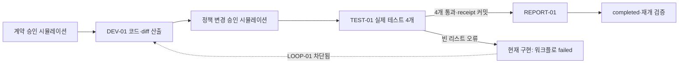

# 예시 실행: 평균 함수 개발·테스트·보완

2026-09-09 후속 수정 판정: **ISSUE-01 수정 완료. 같은 WF-0001에서 실패 → 개발 보완 → 테스트 4/4 통과 → 보고서 완료를 확인했다.** 아래 최초 실패 증거는 덮어쓰지 않고 보존했다.

## 후속 수정 결과

- 검증 실패는 시도와 노드에 `failed`로 남긴다. 명시적 보완 loop가 있으면 워크플로는 `ready / rework_required`, 없으면 `awaiting_data / rework_required`가 된다.
- 실패한 테스트를 retry/fallback으로 무조건 재실행할 수 없다. 승인된 계약의 loop를 거쳐 보완된 입력으로 새 시도를 진행해야 한다.
- 독립 검토에서 찾은 승인 대기 경로도 수정했다. loop 허용 표시는 Tier3 승인 요청 때 소모하지 않고 실제 새 호출이 시작될 때만 소모한다. 수정 후 서로 다른 일회성 승인으로 첫 실패와 보완 실행을 검증했다.
- 예산·시간·루프 한도, 정책 차단, 승인 거부, 미정산 호출에 대한 최종 종료/차단은 그대로 유지한다. 이전 terminal 워크플로를 자동으로 되살리지는 않는다.
- 같은 WF-0001: `DEV-01/attempt-1 done → TEST-01/attempt-1 failed → DEV-01/attempt-2 done → TEST-01/attempt-2 done → REPORT-01/attempt-1 done`. 보완 루프 1회, 실패 이력 1개 보존, receipt 4개(이전 개발 증빙 포함), 최종 `completed`.
- 새 회귀 테스트 4개를 포함한 런타임 테스트 **40/40 통과**, v1·정책·스키마 30개를 합쳐 **70/70 통과**. 부하·경쟁·장애 주입 **5/5 그룹 통과**. 예시 명령 **exit 0**. 승인·모델 호출 관련 시뮬레이션 범위는 기존과 동일하다.

[최종 수정 후 정량 JSON](verified-fix.json) · [동일 워크플로 완료 보고서](verified-fix-evidence/WF-0001/report.md) · [상태·실패 이력](verified-fix-evidence/WF-0001/state-snapshot.json)

[회귀 테스트 출력](after-fix-regression.txt) · [수정 후 부하·장애 원시 결과](after-fix-probe.json). 검증한 `graph_runtime.py` SHA-256: `baa92900628a9d4dd92a9668aadb42e77b33278c2c4a55ef71da54e47fc38c6c`.

## 최초 검증 기록 — 수정 전

최초 판정: 정상 경로는 통과했지만 테스트 실패 후 개발로 돌아가는 루프에서 차단 결함을 발견했다. 최초 예시 작성·검증 시에는 런타임 코어를 수정하지 않았다. 아래 측정치는 수정 전 기록이다.

## 예시와 성공 조건

작은 Python 함수 `average(values)`를 대상으로 한다. 정상 수열 `[2,4,6] → 4`, 빈 리스트 `[] → None`, 음수 `[-4,-2] → -3`, 단일 원소 `[7] → 7`의 네 조건을 실제 Python unittest로 실행했다.

개발 노드는 미리 작성한 예시 코드를 산출물로 저장하고 실제 diff를 제출한다. 테스트 노드는 해당 코드와 테스트 명세 참조를 읽어 별도 Python 프로세스에서 실행한다. 보고 노드는 테스트 receipt가 있어야 실행된다. UI가 없는 함수이므로 화면 검사는 대상이 아니며 외부 조사도 하지 않았다.

인간 승인 authority는 **테스트용 시뮬레이션**이다. 실제 사용자 인증·HIL 합의를 검증한 것이 아니다. 개발 에이전트·모델을 호출하지 않고 결정적인 로컬 코드를 사용했다. 해당 로컬 어댑터는 유료 서비스를 호출하지 않으므로 사용량 0이며, 이 대화의 모델 사용량을 0이라고 주장하지 않는다.



## 정량 결과

| 항목 | 실패 예시 WF-0001 | 수정 코드 대조군 WF-0002 |
| --- | --- | --- |
| 실제 함수 테스트 | 3 통과 / 1 오류 | 4 통과 / 0 오류 |
| 테스트 오류 | `ZeroDivisionError` | 없음 |
| 테스트 성공 receipt | 없음: 실패 증거를 성공으로 처리하지 않음 | 있음 |
| 전체 receipt | 개발 1개 | 개발·테스트·보고 3개 |
| 정책 조정 | 루프 상한 2 → 3, 정책 v1 → v2 | 동일 |
| 개발 보완 루프 | **차단, 실행 0회** | 새 워크플로의 대조군이므로 해당 없음 |
| 최종 상태 | `failed / evidence_gate_failed` | `completed`, resume 후 유지 |

실패 예시에서 `LOOP-01` 엣지가 실제로 존재해도 `Runtime.loop()`가 `loop blocked by terminal/unsettled state`를 반환했다. 예시 실행 명령은 이를 숨기지 않고 **exit 1**로 끝난다. 수정된 코드는 별도 워크플로에서만 완료했으므로 실패한 워크플로의 자동 복구 성공으로 계산하지 않는다.

설정 변경과 이력 저장은 두 워크플로에서 확인했다. 실행시간이 뒤로 가지 않고 알려진 0 사용량이 유지되는 것도 확인했지만, 이 예시만으로 비영(非零) 비용 예산 보존까지 검증했다고 주장하지 않는다.

## ISSUE-01 — 테스트 실패가 보완 루프를 막음

- 범위: 이 예시의 `WF-0001 / TEST-01/attempt-1`.
- 영향: 핵심 요구인 “테스트 실패 → 개발 보완 → 재테스트”가 같은 워크플로 안에서 진행되지 않는다. 수치 조정만으로 해결할 문제가 아니다.
- 경로: `settle()`의 실패 증거 → `fail_attempt(..., 'evidence_gate_failed')` → 워크플로 `failed` → `loop()`의 terminal 상태 차단.
- 원인: `fail_attempt()`는 retry/fallback 복구만 고려하고 명시적 loop 복구 엣지는 고려하지 않는다. 반면 `loop()`는 최종 실패 상태를 허용하지 않는다.
- 기존 검증의 빈틈: 기존 `test_loop_edge_cap_and_receipt_invalidation`은 **성공한 노드**에서 루프를 시작한다. 실제 테스트 실패 후 루프는 검사하지 않아 36개 런타임 테스트 통과와 이 결함이 공존할 수 있다.
- 수정 시 지켜야 할 조건: 복구 가능한 테스트 실패와 최종 워크플로 실패를 구분하고 명시적 루프만 허용해야 한다. 안전 위반·예산 초과·미정산 호출·승인 거부를 루프로 우회해서는 안 된다. terminal 차단을 통째로 제거하는 것은 해결책이 아니다.

## 재현과 증거

레포 루트에서:

```sh
PYTHONDONTWRITEBYTECODE=1 python3 tests/example-average-workflow.py
```

매번 새 임시 Git 워크스페이스를 만들며 SQLite·증빙 파일을 보존하고 경로를 출력한다. 수정 전에는 exit 1로 결함을 재현했고 현재 수정 후에는 exit 0으로 동일 워크플로 보완 완료를 검증한다. `--output /새/경로/result.json`을 주면 JSON과 `result-evidence/`를 함께 내보낸다. 증거 디렉터리가 이미 있으면 덮어쓰지 않는다. 내보낸 state JSON은 읽기용 스냅샷이며 원래 SQLite를 대체하지 않는다.

- [실행 가능한 예시](../../../tests/example-average-workflow.py)
- [정량 JSON](result.json)
- [실패 예시 상태](result-evidence/WF-0001/state-snapshot.json) · [실패 실행 보고서](result-evidence/WF-0001/report.md)
- [실패 테스트 원본 로그](result-evidence/WF-0001/artifacts/d371b5d8e9f7dfff6cf62a70adf448aad21347e774f4984c2fc556c6b227ea3b)
- [수정 코드 대조군 상태](result-evidence/WF-0002/state-snapshot.json) · [완료 실행 보고서](result-evidence/WF-0002/report.md)
- [통과 테스트 원본 로그](result-evidence/WF-0002/artifacts/6f16cb9e88e47b31b28423043c3cad1892256560caf16572ca5e701290deb442)

수정 전 결론: 증거 게이트·정상 단계 연결·정책 버전 변경·receipt·정상 완료 재개는 동작했지만 실패 후 보완 루프는 미통과였다. 이후 수정 결과는 문서 상단과 별도 after-fix 증거를 따른다.
