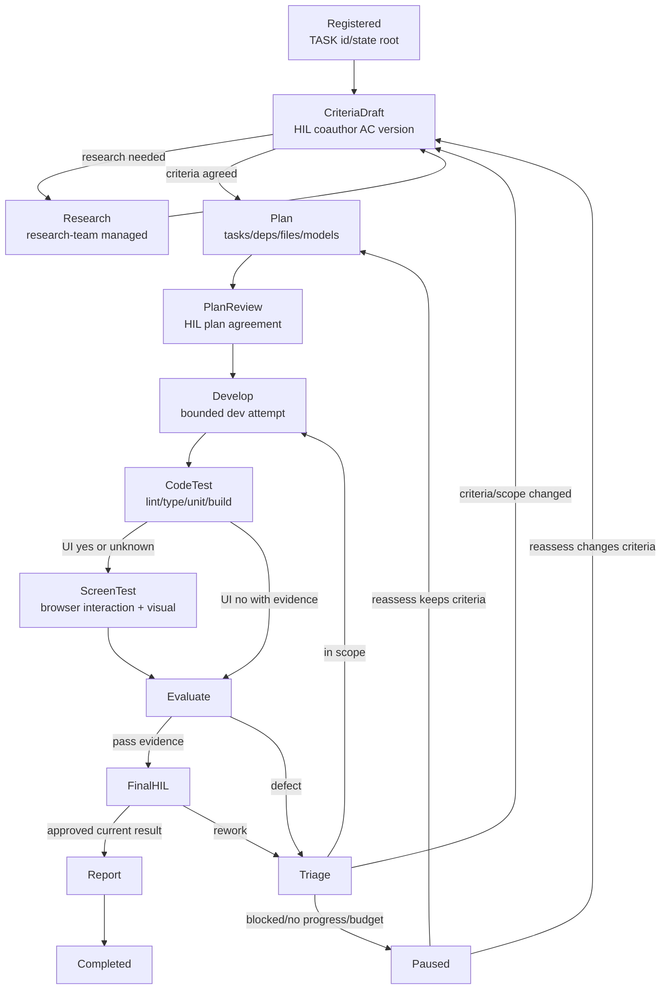

# task-orchestrator 스킬 설계

날짜: 2026-09-09

## 목적

사용자가 요청한 작업을 전역 루프와 개발 내부 DAG로 관리한다. 전략 수립, 필요한 자료조사,
구현, 코드 테스트, 화면 테스트, 사용자와 공동 작성한 성공 조건, 최종 승인, 보고서를 하나의
task-local 상태로 묶는다.

새 워크플로 엔진은 만들지 않는다. 실행 주체는 현재 Claude/Codex 리더이며, 기존 스킬은 managed
mode 절차로 호출된다.

## 실행 그래프



## State Contract

`state.json` is the single writer-owned truth. The task-state helper keeps history
inside that file; `events.jsonl` must not become a second truth source.

The CLI-enforced state document includes:

- workspace path, task id, revision
- criteria ids, version, user agreement references
- plan version, task ids, dependencies, owned files, model route
- phase, task status, current attempts
- research status, required flag, criteria version, evidence path/hash, question
- issues with linked task/effective owner, immutable origin, evidence path/hash
- validation commands, results, evidence paths, code fingerprint
- HIL decisions scoped to criteria/plan/result version
- actual model routing and caller-supplied usage, or `unknown`
- artifact paths and report path

Artifact payloads should contain richer operational evidence such as source
confidence, citations, screenshots, issue severity, and reproduction steps. Those
details are required by the orchestration protocol, but not all are separate
validated `state.json` fields.

Mutation is optimistic: callers read `revision`, then apply an event with
`--expected REV`. If the revision changed, the orchestrator rereads and decides
whether to replay or replan.

CLI surface:

```bash
python3 <skill-source>/scripts/task_state.py init --workspace /repo --title "task title"
python3 <skill-source>/scripts/task_state.py show --task /repo/nimbalyst-local/tasks/TASK-0001
python3 <skill-source>/scripts/task_state.py snapshot --task /repo/nimbalyst-local/tasks/TASK-0001
python3 <skill-source>/scripts/task_state.py apply --task /repo/nimbalyst-local/tasks/TASK-0001 --expected REV --event /tmp/event.json
```

Event families: `criteria`, `approve`, `research`, `plan`, `start`, `finish`,
`check`, `issue`, `issue-reassign`, `rework`, `evaluate`, `pause`, `complete`,
`cancel`.
Exact event JSON is documented in
`.claude/skills/task-orchestrator/references/events.md`.

The script requires POSIX file locking, Python 3.10+, and `--workspace` equal to a
Git worktree root. A workspace-wide flock serializes task allocation and enforces
same-workspace development concurrency/ownership gates. Fingerprinting excludes
ignored runtime inputs, so callers must record those protocol-only inputs as
evidence when relevant. Git submodule inputs are rejected; use a separate supported
worktree without submodule entries when that code must be tracked.
CLI smoke tests must use the canonical task path returned by `init` because macOS
may resolve `/tmp` to `/private/tmp`. Nonignored event/output files outside
artifacts are source inputs and change the fingerprint.

## Managed Skill Contracts

`research-team` managed call receives task root, criteria version, question, mode,
required flag, and artifact directory. It records `status`
(`answered`, `no-claims-found`, `no-confirmed-claims`, `synthesis-failed`), an
actual evidence path, and the research question. Required research blocks planning
unless the status is `answered`, its recorded `criteria_version` matches current
criteria, and its evidence hash is still valid. After criteria change, required
research must be rerecorded or HIL must explicitly approve a scope adjustment that
sets that research item to `required: false` before reapproval. The finder and
verifier are separate children or roles when available; a finder self-check is not
independent verification. Managed research never executes standalone `workflow.mjs`,
even when a Workflow tool exists.

`archon-adversarial-dev` managed call receives task root, criteria version, plan
version, selected `DEV-##`, attempt, artifact directory, and file ownership. It
uses its workflow text as procedure, not by executing its standalone `workflow.mjs`.
It performs one bounded implementation/review attempt, does not reset the task dir,
does not replan the outer task, does not run its own retry loop, and does not nest
delegation. Use a development executor followed by an independent reviewer when the
current environment supports it.

`test-agent-team` managed call receives task root, criteria version, code
fingerprint, selected checks, UI impact (`yes`, `no`, `unknown`), and artifact
directory. UI impact `yes` or `unknown` requires an actual browser test covering
both interaction and visual inspection. If the browser cannot run, the result is
`blocked`, not `pass`. Managed testing keeps the relevant body rules: repository
CI/script tool detection, code-check concurrency safety, a single UI lane, cleanup
of only the dev server PID it started, and dApp wallet hard-stops/test-account/
sensitive-data guardrails.

All managed calls return after the managed branch; they do not continue into later
standalone-only sections. If fixed Claude/Codex branded roles are unavailable, the
orchestrator records the available native-role substitution and does not claim
cross-provider execution that did not happen.
The leader dispatches managed child roles directly; managed children do not spawn
their own team or subagents.

## Development DAG

Inside the `Develop` node, planned tasks are a DAG:

- each task is independently implementable and testable
- implementation and its regression test stay together
- ownership uses literal workspace-relative POSIX paths only: no globs, symlinks,
  absolute paths, or `..`
- shared file/resource ownership serializes or merges tasks, including other running
  tasks in the same workspace
- small work may be a single task
- tasks are not split so small that orchestration costs dominate

Open issues keep immutable original `task_id` and `description`. Use
`issue-reassign` during `planning` or `plan_hil` to point an issue at a replacement
`DEV-##`/`FIX-##`, including an upcoming FIX item; the replacement plan must include
the effective owner for every open issue.

## Invalidation

Changing criteria invalidates prior criteria approvals and validations tied to the
old criteria version. Changing code invalidates validations and final approvals tied
to the old code fingerprint. The fingerprint passed to a `check` event is taken
immediately before the actual verification command or browser procedure. Completion
cannot use stale approval or stale test evidence.

## HIL Policy

HIL is collaborative, not only a gate. Use it to coauthor acceptance criteria,
resolve materially changed scope, choose when the development attempt budget
(`max_attempts`) or stalled-same-result heuristic (`max_no_progress`) is hit, and
approve the final current result. The orchestrator must not invent human
approval or treat an older approval as current after criteria/code changes.
The script records the user's message reference and text but does not authenticate
the speaker.

## Completion

The task reaches `Completed` only when:

1. current agreed criteria are satisfied;
2. required code checks pass against current code;
3. UI screen test passes when UI impact is yes or unknown;
4. no blocking issue remains;
5. the user approves the current result version;
6. `report.md` is saved.

`evaluate` in `reporting` preserves a still-valid final approval instead of forcing
another HIL round.

## Scope Boundaries

- No new framework or external dependency.
- No global installation claim; this is project-scope unless copied elsewhere.
- Codex App can resume from saved state but does not perform autonomous background
  scheduling by itself.
- The state script records caller-supplied model routing and usage; it does not
  automatically measure model cost or enforce spend caps.
- There is no `resume` event. Resuming means reading existing state, reconciling
  pending/running artifacts, and recording the next actual user decision or valid
  event.
