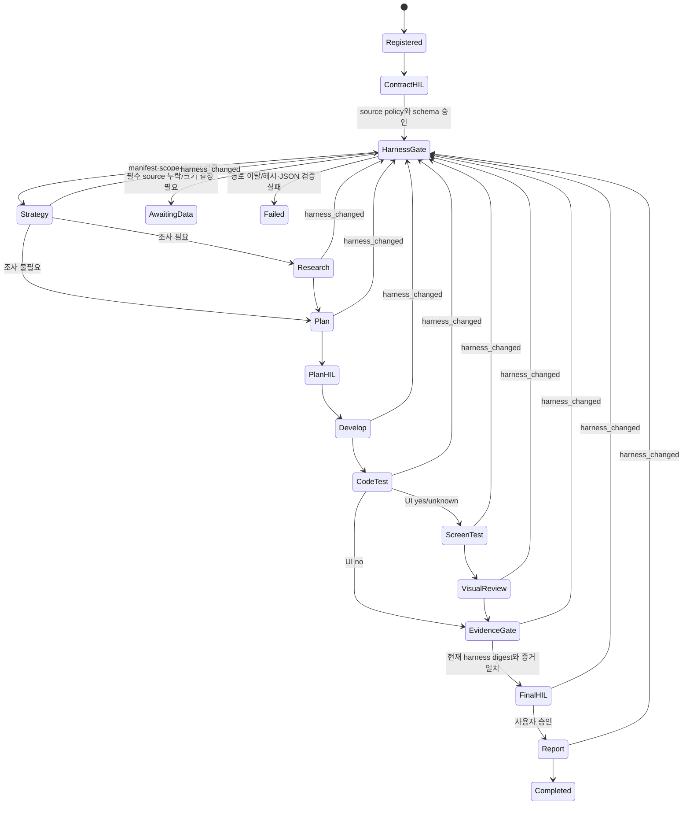

# task-orchestrator Harness Gate 설계

날짜: 2026-09-09

## 결정

`task-orchestrator`는 `agent-context-setup`이나 `repo-convention-extractor`를
실행하지 않는다. 대신 대상 저장소에 이미 존재하는 지침·컨텍스트 하네스를 작업
입력으로 발견하고, 적용 범위와 해시를 검증한 `Harness Gate` receipt를 만든다.
계획·조사·개발·테스트·보고 단계는 이 receipt의 현재 버전에 결속된다.

현재 `agent-context-setup`이 직접 만드는 Markdown은
`.agent-context/DOMAIN.md`다. 코드 스타일과 주석 규칙은 저장 옵션으로 실행된
`repo-convention-extractor`의 `CONVENTIONS.md`와 `.repo-conventions.json`, 또는
저장소의 `AGENTS.md`·`CLAUDE.md` 등에 있을 수 있다. 존재하지 않는 산출물을
생성됐다고 가정하지 않는다.

## 목표와 제외 범위

목표:

- 이미 존재하는 하네스를 결정적으로 발견하고 workspace-relative 경로, 적용 scope,
  우선순위, SHA-256, 크기로 manifest화한다.
- 모든 managed agent/tool 호출에 현재 작업 경로에 적용되는 하네스 bundle과 digest를
  신뢰된 실행 context로 전달한다.
- downstream receipt와 HIL approval을 harness digest에 결속하고, 변경 시 stale 결과를
  사용하지 않는다.
- 필수 입력 누락은 `awaiting_data`, 경로 이탈·해시 위조·스키마 손상은 `failed`로
  fail closed 한다.

제외 범위:

- `agent-context-setup` 또는 컨벤션 추출기의 자동 호출
- Markdown 내용을 셸 명령이나 도구 권한으로 승격
- 하네스가 없는 저장소에 스타일 규칙을 추측해서 생성
- 일반 문서를 시스템·사용자 지시보다 높은 권한으로 취급

## 입력 소스와 우선순위

기본 후보는 다음과 같다.

1. 대상 경로에 적용되는 `AGENTS.override.md`
2. 가장 가까운 scope의 `AGENTS.md`
3. 적용 가능한 `CLAUDE.md`
4. `.repo-conventions.json`의 검증된 findings
5. `CONVENTIONS.md`
6. `.agent-context/*.md` (`DOMAIN.md` 포함)

`AGENTS.md`, `AGENTS.override.md`, `CLAUDE.md`는 런타임 지침 계층을 유지한다.
`CONVENTIONS.md`와 `.agent-context/*.md`는 프로젝트 컨텍스트이며 권한을 부여하지
않는다. `.repo-conventions.json`이 있으면 기계적 컨벤션 검사는 JSON을 사용하고
Markdown을 파싱해 규칙을 재구성하지 않는다.

계약 HIL에서 각 경로 또는 source kind를 `required`나 `optional`로 정하고 파일당,
전체 bundle당 크기 상한을 조정할 수 있다. 기본 후보가 모두 optional이고 파일이
하나도 없으면 명시적인 empty manifest receipt로 통과한다. 필수 source가 없거나
상한 조정이 필요하면 `awaiting_data`로 간다.

심볼릭 링크, Git submodule 경계, `..`, 저장소 밖 realpath는 거부한다. 후보 파일의
본문은 artifact store에 두고 그래프에는 참조와 digest만 저장한다.

## 그래프



각 `harness_changed` 선은 계약에 저장되는 명시적 `revalidate` trigger edge다.
guard는 `harness_changed`, target은 `HARNESS-01`로 고정한다. 런타임은 모든
admit/resume/retry/loop/finalize 직전에 현재 파일을 재검증하고 guard가 참이면 해당
edge를 자동 선택한다. 이 안전 전이는 retry 횟수나 개발 loop 예산을 소비하지 않는다.
변경을 발견하면 신규 호출을 중지하고 기존 receipt는 보존하되 현재 결과로 사용할 수
없게 표시한 뒤 `HarnessGate`부터 재개한다.

## 노드 계약

새 canonical stage kind는 `harness_gate`다.

edge closed vocabulary에는 `trigger: revalidate`와 `guard: harness_changed`를
추가한다. `revalidate`는 `harness_gate` 이후 노드에서 `HARNESS-01`로 향할 때만
허용하며, 다른 target이나 사용자 직접 호출은 계약 검증에서 거부한다.

```json
{
  "node_id": "HARNESS-01",
  "kind": "harness_gate",
  "actor": {
    "kind": "external_system",
    "principal_id": "trusted-harness-loader",
    "role": "workspace-instruction-loader"
  },
  "input_schema": {
    "type": "object",
    "properties": {
      "workspace_ref": {"$ref": "ArtifactRef"},
      "source_policy_ref": {"$ref": "ArtifactRef"},
      "owned_paths_ref": {"$ref": "ArtifactRef"}
    },
    "required": ["workspace_ref", "source_policy_ref", "owned_paths_ref"]
  },
  "output_schema": {
    "type": "object",
    "properties": {
      "manifest_ref": {"$ref": "ArtifactRef"},
      "scope_map_ref": {"$ref": "ArtifactRef"},
      "bundle_ref": {"$ref": "ArtifactRef"},
      "validation_result_ref": {"$ref": "ArtifactRef"},
      "harness_digest": {"type": "string"},
      "status": {"type": "string", "enum": ["ready", "empty"]}
    },
    "required": ["manifest_ref", "scope_map_ref", "bundle_ref", "validation_result_ref", "harness_digest", "status"]
  },
  "required_evidence": [
    {"field": "manifest_ref", "validator": "harness_manifest"},
    {"field": "scope_map_ref", "validator": "artifact"},
    {"field": "bundle_ref", "validator": "artifact"},
    {"field": "validation_result_ref", "validator": "json_success"}
  ],
  "tool_routes": ["trusted-harness-loader"]
}
```

실제 Python 스키마는 기존 closed vocabulary로 표현한다. `$ref` 표기는 설계 가독성을
위한 축약이다. 기존 `artifact` validator는 artifact의 존재와 content hash를 확인하고,
기존 `json_success`는 테스트형 검증 결과에만 사용한다. 새 `harness_manifest` validator
하나가 manifest와 scope map의 closed schema, 각 entry artifact의 hash, source policy,
bundle ref, 그리고 출력 `harness_digest`의 canonical JSON 재계산 결과를 함께 검증한다.

Harness Gate runner의 outcome은 일반 adapter 오류에 맡기지 않고 다음처럼 정규화한다.

| Runner outcome | Workflow 상태 | Receipt |
| --- | --- | --- |
| `ready`, `empty` | `ready` | 생성 |
| `required_source_missing`, `size_decision_required` | `awaiting_data` | 생성하지 않음 |
| `path_escape`, `symlink`, `submodule_escape`, `digest_mismatch`, `invalid_json`, `invalid_schema` | `failed` | 생성하지 않음 |

`settle()`은 `harness_gate`에 한해서 이 closed outcome을 먼저 처리한다. 목록 밖 outcome은
`failed: invalid_harness_outcome`이다.

## Artifact 스키마

`source_policy_ref`는 다음 closed JSON을 가리킨다.

```json
{
  "schema": 1,
  "source_kinds": [
    {
      "kind": "agents_override",
      "patterns": ["AGENTS.override.md", "**/AGENTS.override.md"],
      "required": false,
      "max_file_bytes": 262144,
      "precedence": 10
    }
  ],
  "allowed_roots": ["."],
  "max_bundle_bytes": 1048576
}
```

`kind`는 `agents_override|agents|claude|repo_conventions_json|conventions|agent_context`만
허용한다. `patterns`는 workspace-relative literal 또는 glob이고 `..`와 절대 경로를
허용하지 않는다. `precedence`는 중복 없는 양의 정수이며 작은 값이 더 강하다.
기본값은 HIL 승인된 contract에 저장하므로 코드에 별도 숨은 우선순위를 두지 않는다.

`owned_paths_ref`는 `{"schema": 1, "paths": ["packages/api"]}` 형태의 closed JSON이다.
경로는 workspace-relative이며 빈 목록은 workspace 전체를 뜻한다.

`manifest_ref`는 `{"schema": 1, "entries": [...]}` 형태이며 entry는 아래 필드만 가진다.
`scope_map_ref`는 다음 closed JSON을 가리킨다.

```json
{
  "schema": 1,
  "projections": [
    {
      "owned_path": "packages/api",
      "entry_paths": ["AGENTS.md", "packages/api/AGENTS.override.md"]
    }
  ]
}
```

각 projection은 해당 경로에 적용되는 entry만 담는다. bundle은 Markdown artifact이며
약한 규칙부터 강한 규칙 순서로 합친다. 동일 scope에서는 큰 precedence부터 작은
precedence 순으로, scope 간에는 workspace root부터 가장 가까운 scope 순으로 배치해
가까운 scope와 작은 precedence가 마지막에 오도록 한다. 같은 priority 충돌은 policy
schema 위반으로 거부한다.

manifest entry는 최소한 다음 필드를 가진다.

```json
{
  "path": "packages/api/AGENTS.md",
  "real_path": "packages/api/AGENTS.md",
  "source_kind": "agents",
  "scope_root": "packages/api",
  "precedence": 20,
  "sha256": "...",
  "bytes": 1234,
  "required": true
}
```

manifest의 canonical 정렬 순서는 `(scope_root, precedence, path)`로 고정한다.
digest는 정렬된 manifest, source policy, owned paths, scope map의 canonical JSON과
bundle content hash에 대해 계산한다. mtime은 신뢰 근거나 digest 입력으로 쓰지 않는다.

## 적용과 receipt 결속

- `VERSION_BINDING`에 `harness_digest`를 추가한다.
- state에는 현재 `harness_version`, `harness_digest`, manifest/scope/bundle refs와
  마지막 검증 시각을 저장한다.
- Harness Gate 이후의 모든 attempt context에는 전체 manifest와 해당 노드의
  `owned_paths`에 투영된 bundle ref가 들어간다.
- strategy/research/plan은 workspace scope bundle을 받는다. develop/test/review는
  소유하거나 검사하는 경로별 가장 가까운 scope 규칙을 받는다.
- managed child 요청에는 `harness_digest`, `harness_bundle_ref`, `applicable_paths`를
  필수 슬롯으로 전달한다. child 결과 receipt도 같은 digest를 반환해야 한다.
- 코드 diff, 테스트 통과, 로그가 있어도 harness digest가 다르면 Evidence Gate는
  통과하지 않는다.

Markdown 안의 명령은 정보일 뿐이다. 실제 tool call은 계속 `before_tool_call`, 위험
tier, 승인, 예산 정책을 통과해야 한다. 하네스는 안전 정책을 완화하거나 승인자를
추가할 수 없다.

## 변경과 재개

`verify_harness_current(state)`는 `before_tool_call`, `resume`, `loop`, `report` 및
완료 판정 직전에 반드시 실행한다. 변경 감지 시 런타임은
`observed_harness_digest`와 바뀐 경로를 기록하고 `awaiting_data: harness_changed`로
전이한다. 이때 `HARNESS-01`과 Strategy부터 Report까지를 `status=pending`,
`receipt=None`으로 되돌리고 plan/final approval을 무효화한다. 실행 중이던 외부
부작용의 결과가 불명확하면 먼저 reconcile하며 자동 재실행하지 않는다.

Harness Gate가 새 bundle을 성공적으로 검증한 뒤에만 `HARNESS-01`을 `status=done`,
`receipt=<new receipt>`로 커밋하고 `harness_version`을 증가시키며 새
`harness_digest`를 현재값으로 저장한다. downstream 노드만 새 digest에 결속해 다시
실행한다. 과거 attempt와 `state.receipts` 목록은 감사 기록으로 유지하지만 dependency
검증에는 각 node의 현재 `receipt`만 사용한다. HIL에서 새 규칙이 현재 작업 결과에
영향이 없다고 판단하더라도 Evidence Gate 재검증과 새 digest에 대한 plan approval은
생략하지 않는다.

프로세스 재시작 후에도 SQLite state와 artifact hash를 기준으로 같은 판단을 한다.
하네스 파일 내용이 원래 digest로 돌아왔더라도 version history를 삭제하지 않는다.

## v1 호환

v1은 강제 런타임이 아니므로 task 시작 시 동일 후보를 읽고
`nimbalyst-local/tasks/TASK-####/artifacts/harness/manifest.json`과 bundle을 저장한다.
criteria, plan, check, final HIL 이벤트에 digest를 기록하고 변경 시 planning으로
되돌린다. v1이 v2 수준으로 안전을 강제한다고 주장하지 않는다.

## 구현 영향 범위

- `.claude/skills/task-orchestrator/SKILL.md`
- `.claude/skills/task-orchestrator/scripts/runtime_contracts.py`
- `.claude/skills/task-orchestrator/scripts/graph_runtime.py`
- `.claude/skills/task-orchestrator/references/runtime-v2.md`
- `.claude/skills/task-orchestrator/references/events.md`
- `docs/skills/task-orchestrator.md`
- 관련 v1/v2 테스트와 예제 contract

새 외부 dependency나 background watcher는 추가하지 않는다. 파일 발견과 SHA-256,
canonical JSON은 Python 표준 라이브러리로 구현한다.

## 검증 조건

1. `agent-context-setup`을 호출하지 않고 fixture의 기존 하네스만 읽는다.
2. root/nested/override scope와 우선순위가 결정적으로 적용된다.
3. 동일 내용은 실행·재시작·파일 mtime 변화와 무관하게 같은 digest를 만든다.
4. 필수 파일 누락은 `awaiting_data`; path escape, symlink, hash 또는 JSON 손상은
   `failed`가 되며 다음 노드를 실행하지 않는다.
5. managed strategy/research/develop/test 호출과 receipt에 올바른 scoped bundle 및
   digest가 전달된다.
6. 하네스 변경 후 기존 plan/test/final approval로 완료되는 경우는 0건이다.
7. 변경 감지 전 완료된 receipt와 사용량·비용·attempt 기록은 삭제되거나 초기화되지
   않는다.
8. Markdown의 도구 실행 문구가 Tier/HIL/budget gate를 우회하는 경우는 0건이다.
9. 하네스가 전혀 없고 모두 optional인 저장소는 검증된 empty receipt로 진행한다.
10. 기존 task-orchestrator 회귀·신뢰성·부하 테스트 결과가 이전 기준보다 퇴행하지
    않는다.
