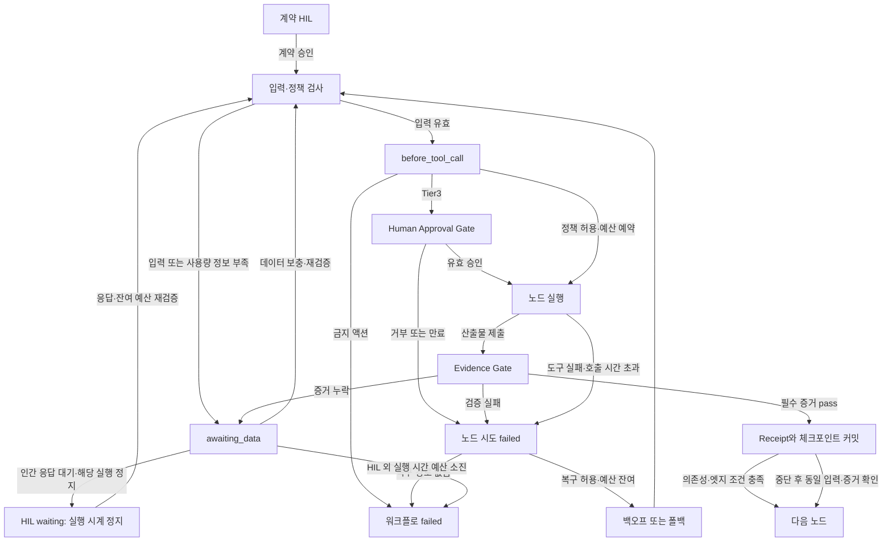

# task-orchestrator v2 — HIL 계약 초안

상태: **2026-09-09 HIL 승인, opt-in 로컬 v2 코어 구현·검증 완료.** 사용자가 현재 기본값으로 진행하고 실사용 이슈에 따라 조정하도록 승인했다. 이 승인은 개별 고위험 액션 승인이 아니다. 실제 Claude/Codex 사용량·승인 어댑터는 미설치이므로 해당 네이티브 관리 실행은 `awaiting_data`로 차단된다. 구현 API와 스키마는 [사용 안내](../../../.claude/skills/task-orchestrator/references/runtime-v2.md), 검증 범위는 [보고서](../../reports/task-orchestrator-v2-2026-09-09/report.md)를 따른다.

## 설정 조정 계약

- 기본값은 한 곳에서 관리하며 워크플로별 부분 override를 허용한다. 재시도·회로 차단·시간·토큰·비용·반복 수치가 조정 대상이다.
- 실행 중 변경은 실행 중인 호출이 없는 HIL 경계에서 승인된 변경안만 적용한다. 이전/새 값, 이유, 승인 근거, 정책 버전을 저장한다.
- 사용한 시간·토큰·비용·시도·반복 횟수와 미정산 예약은 유지한다. 낮춘 한도가 누적 사용량 이하이면 신규 실행을 중단한다.
- 설정 버전 변경은 이전 승인을 무효화한다. 승인 거부 기본값, 알 수 없는 사용량 차단, 증거 필수 같은 안전 불변식은 수치 조정으로 끌 수 없다.

## 1. 이미 합의된 원칙

1. 토큰·비용 사용량을 검증하거나 최대 소모량을 제한할 수 없는 호출은 실행하지 않고 `awaiting_data`로 보낸다.
2. 노드 시도의 `failed`와 워크플로의 최종 `failed`를 구분한다.
3. 실패한 시도의 기록은 보존한다. 재시도는 새 attempt이며, 실패 기록을 성공으로 덮어쓰지 않는다.
4. HIL에서 인간의 응답을 기다리는 시간은 워크플로 실행 제한시간에 포함하지 않는다.

## 2. 적용 범위와 비목표 — 제안

- task-orchestrator로 등록한 워크플로에 적용한다. 다른 일반 대화나 글로벌 스킬 동작은 변경하지 않는다.
- 관리되는 워크플로 내부의 리더·검증자·하위 모델 호출까지 예산에 포함한다. 현재 대화에서의 사전 설계를 비용 통제된 워크플로 실행으로 주장하지 않는다.
- 사용량/상한/호출 차단을 보장할 수 없는 네이티브 세션은 관리 실행을 시작하지 않는다. 사용자 지정 문자열이나 임의의 `usage=0`으로 우회할 수 없다.
- 실제 호출은 공통 실행 게이트를 통과해야 한다. 등록된 도구·모델 어댑터가 실제 보장하는 기능만 사용한다. 훅 설치 사실만으로 모든 실행이 통제된다고 판단하지 않는다.
- 검증은 로컬 임시 저장소와 가짜 결제·삭제·발송 어댑터로 수행한다. 실제 결제, 사용자 데이터 삭제, 메시지 발송, 새 클라우드 서비스 도입은 이 구현 검증의 범위가 아니다.
- 기존 v1 상태를 자동으로 덮어쓰지 않는다. v2로 전환할 때 계약 HIL과 명시적 변환·검증이 필요하다.

## 3. 스키마 표기와 공통 타입

아래는 사람과 검토할 타입 계약이다. 합의 후 기계 검증 가능한 스키마·검증기로 옮긴다. 명시된 선택 필드 외에는 필수이며, 알려지지 않은 필드·잘못된 타입은 거절한다.

| 타입 | 필수 필드와 제약 |
| --- | --- |
| `ArtifactRef` | `uri:string`, `sha256:64자리 hex`, `media_type:string`, `bytes:nonnegative_int`; 허용된 저장소의 불변 객체만 참조 |
| `Actor` | `kind:agent/external_system/human`, `principal_id:string`, `role:string`; 실행 어댑터가 확인한 실제 주체와 결속 |
| `VersionBinding` | `workflow_id`, `contract_version`, `plan_version`, `input_digest`, 해당 시 `code_fingerprint` |
| `Approval` | `approval_id`, 검증된 `approver_id`, `action_digest`, `version_binding`, `issued_at`, `expires_at`, `decision:approve/deny`, `single_use:true`, `auth_evidence_ref` |
| `EvidenceResult` | `check_id`, `validator_id`, `validator_version`, `status:pass/fail/missing/error`, `subject_digest`, `evidence_refs:ArtifactRef[]`, `observed_at` |
| `Usage` | `input_tokens:int`, `output_tokens:int`, `other_billable_tokens:int`, `cost_microusd:int`, `meter_id`, `price_version`; 부재는 0이 아님 |
| `ExecutionClock` | `limit_s`, `consumed_s`, `remaining_s`, `last_accounted_at`, `hil_wait_intervals[]`; HIL 대기 시작·종료와 제외 시간을 저장하며 누적 사용 시간을 초기화하지 않음 |
| `StepReceipt` | `receipt_id`, `node_id`, `attempt_id`, `actor`, `version_binding`, `input_refs`, `output_refs`, `evidence_results`, `usage`, `started_at`, `finished_at`, `commit_seq` |
| `NodeContract` | `node_id`, `actor`, `input_schema_ref`, `output_schema_ref`, `required_evidence`, `timeout_s`, `retry_policy`, `quality_policy`, `risk_policy` |
| `EdgeContract` | `edge_id`, `from`, `to`, `trigger`, `guards`, `required_inputs`, `required_receipts`, `on_missing`, `on_invalid`; guard는 등록된 검증 조건으로만 구성, 임의 코드 eval 금지 |

승인 메시지를 적어 넣는 것만으로 `Approval`이 성립하지 않는다. 승인자의 실제 신원을 확인할 어댑터가 없으면 승인이 필요한 액션은 차단한다. 해시는 무결성 증거이지 사용자 인증 수단이 아니다.

## 4. 상태별 입력·산출물 계약

모든 입력·출력은 공통 버전 결속을 포함한다. 아래 `*_ref`는 `ArtifactRef`다.

| 노드 | 주체 | 입력 필드 | 산출물 필드 | 완료 증거 |
| --- | --- | --- | --- | --- |
| `contract_hil` | human | `request_ref`, `draft_contract_ref` | `approved_contract_ref`, `approval` | 계약·스키마·예산·실행 범위 승인 |
| `strategy` | agent | `approved_contract_ref`, `request_ref` | `strategy_ref`, `research_questions[]`, `risk_findings[]` | 범위·목표·위험 항목 누락 없음 |
| `research` | agent | `question`, `scope_ref`, `required:bool` | `report_ref`, `claim_verdicts_ref`, `source_refs[]`, `status` | 필수 질문에 답변, 출처와 독립 검증 결과 |
| `plan` | agent | `strategy_ref`, `required_research_receipts[]` | `dag_ref`, `ownership_ref`, `acceptance_mapping_ref` | 비순환 의존성, 필수 기준의 검증 매핑, 소유권 충돌 통제 |
| `plan_hil` | human | `plan_ref`, `contract_ref` | `approval` | 현재 계획 버전 승인 |
| `develop` | agent | `work_item_ref`, `approved_plan_ref`, `baseline_ref` | `diff_ref`, `result_refs[]`, `change_summary_ref` | 허용 범위 내 실질 diff, 산출물 해시·기본 검사 |
| `code_test` | external_system | `code_ref`, `test_spec_ref` | `test_results_ref`, `log_ref`, `exit_code:int` | 필수 테스트 통과, 예상 종료 코드, 치명적 로그 오류 없음 |
| `screen_test` | external_system | `build_ref`, `scenario_ref`, `ui_impact:yes/unknown` | `interaction_results_ref`, `screenshots_ref`, `trace_ref` | 실제 상호작용 결과와 시각 판정용 증거 |
| `visual_review` | agent | `screenshots_ref`, `interaction_results_ref`, `visual_criteria_ref` | `verdicts_ref`, `finding_refs[]` | 기준별 판정·화면 근거, 필수 시각 기준 통과 |
| `evidence_gate` | external_system | `producer_output_refs`, `required_checks_ref`, `version_binding` | `gate_result`, `verified_evidence[]` | 모든 필수 증거가 현재 버전·해시에 대해 pass |
| `human_approval_gate` | human | `action_ref`, `risk_summary_ref`, `approver_policy_ref` | `approval` | 정확한 액션·인자·대상에 대한 유효한 일회성 승인 |
| `final_hil` | human | `verified_result_ref`, `receipt_refs[]`, `remaining_risks_ref` | `approval` | 현재 결과 버전 승인 |
| `report` | agent | `approved_result_ref`, `receipt_refs[]`, `usage_summary_ref` | `report_ref` | 결과·이슈·실제 사용량·제한·증거 링크 누락 없음 |

`research.status`: `answered/no-claims-found/no-confirmed-claims/synthesis-failed`. 필수 조사 미충족은 성공으로 건너뛰지 않는다. 필요 없는 조사·UI 노드는 승인 계약에서 명시적으로 제외하며, 실패한 필수 검사를 사후 `not-applicable`로 바꾸지 않는다.

diff 존재는 개발 노드 조건이지 모든 노드 조건이 아니다. 로그 정상 여부는 작업별 승인된 종료 코드와 구조화된 치명 오류 규칙으로 판정하며, AI의 막연한 '로그가 좋아 보임'은 증거가 아니다. 필수 품질 기준 통과율은 100%, 해결되지 않은 차단 이슈는 0개다. 별도 품질 점수를 쓰는 작업은 점수 산출기·버전·임계치를 계약 HIL에서 정의해야 하며, 미정이면 실행하지 않는다.

## 5. 엣지·실패·복구

- **실패 시도는 불변**이다. 재시도·폴백은 새로운 attempt이며 기존 실패 기록을 유지한다.
- `awaiting_data`에서는 부작용 있는 호출을 중지하고 부족 필드·증거·예산 정보를 기록한다. 전이 실패 시 원래 노드를 계속 실행하지 않는다.
- 전역 예산/시간/안전 검사는 모든 엣지보다 우선한다. 초과는 워크플로 최종 `failed`와 구체적 reason으로 저장한다.
- 인증 실패·정책 금지·결과 불명확한 결제/삭제/발송은 자동 재시도하지 않는다. 외부 결과 불명확은 `awaiting_data`에서 조회·인간 확인으로 해소한다.
- 잘못된 외부 이벤트, 인증되지 않은 요청, 구 revision 요청은 기존 실행을 파괴하는 실패 이벤트로 취급하지 않고 거절한다. 유효한 현재 시도의 계약 불충족만 상태를 전이시킨다.
- 사용자가 이미 부여한 권한 범위 안에서, 순수/멱등 실행만 사전 정의된 재시도 엣지를 이용한다. 재시도 거절은 실패 기록 삭제나 새 ID로 예산 초기화할 근거가 아니다.

## 6. 기본 시간·재시도 정책 — HIL 제안값

| 속성 | 제안 기본값 | 의미 |
| --- | --- | --- |
| `workflow_timeout_s` | 3600 | 실행 시간 예산 60분; 인간 응답만 기다리는 HIL 구간 제외 |
| `stage_timeout_s` | 900 | 스테이지 실행 시간 예산 15분; 해당 HIL 대기 제외, 재시도로 초기화하지 않음 |
| `tool_timeout_s` | 120 | 도구 호출당 2분 |
| `approval_timeout_s` | 600 | 승인 게이트의 별도 벽시계 10분; 실행 시간에 합산하지 않으며 만료 시 기본 거부 |
| `retry.max_attempts` | 3 | 최초 시도 포함, 폴백으로 초기화하지 않음 |
| `retry.base_delay_s` / `cap_delay_s` | 1 / 30 | full jitter: U(0, min(30, 1 × 2^(retry_index-1))) |
| `retry.max_elapsed_s` | 180 | 노드별 재시도 시간 예산; 상위 잔여시간 이내 |
| `breaker.failure_threshold` | 3 | 같은 도구/모델 경로에서 재시도 가능한 실패 연속 3회 |
| `breaker.cooldown_s` | 60 | 60초 차단 후 half-open 상태에서 시험 호출 1개만 허용 |

실제 도구 제한시간은 `min(도구 설정, 스테이지 잔여 실행시간, 워크플로 잔여 실행시간)`이다. 백오프와 재시도 시간 예산에도 동일 상위 제한을 적용한다. HIL 응답 대기는 실행 시계에서 제외하지만, 승인 유효기간은 별도 벽시계 정책이므로 실행 제한시간과 합산하거나 동일한 deadline으로 취급하지 않는다.

- HIL 질문·승인 요청을 보낸 뒤 **인간 응답만 기다리는 구간**의 시작·종료를 커밋한다. AI가 질문을 작성하거나 응답을 검토·실행하는 시간은 실행 시간이다.
- 해당 스테이지의 HIL 대기는 그 스테이지의 실행·재시도 시간 예산에서 제외한다. 워크플로 전체 시계는 다른 병렬 스테이지나 도구도 실행되지 않을 때만 정지한다. 인간을 기다린다는 표식으로 실제 작업 시간을 숨기지 못한다.
- 도구 호출 자체의 시계는 중간에 정지하지 않는다. 실행 중인 도구가 있다면 그 호출의 기존 제한시간을 계속 적용한다.
- 일반 `awaiting_data`, 도구 응답 대기, 백오프·회로 차단 대기는 자동으로 HIL 면제 시간이 되지 않는다. 검증된 인간 응답 대기 구간만 제외한다.
- 재개 시 `남은 실행시간 = 설정 한도 - 누적 실행시간`을 복원한다. 프로세스 내 시간은 단조 시계로 계측하고, 중단·재개 시 저장된 계측 시점과 HIL 구간을 대조한다. 기록 없는 중단을 HIL로 간주하지 않는다.
- HIL 대기는 이미 소진한 실행시간·토큰·비용·시도 횟수를 돌려주지 않는다. 예산 소진 후 HIL에 들어가 종료를 회피할 수도 없다. 시계/구간 기록이 불일치하면 호출을 차단하고 확인한다.

실행 시간 예산 소진 시 감독 실행기가 신규 호출을 금지하고 통제 가능한 호출을 중단한다. 실행기 자체가 중단돼 있으면 재개 첫 검사에서 누적 실행시간과 HIL 제외 구간을 복원한 후 소진 여부를 판단한다. 외부 서비스가 취소를 보장하지 않는 경우 미확정 부작용과 예약 예산을 보존하며, 자동 재시도하지 않는다.

회로 차단기는 workspace 내 도구/모델 경로별로 관리한다. 스키마 오류·인간 거부를 서비스 장애 횟수로 잘못 세지 않는다. 주 경로가 열리면 사전 승인한 대체 경로로만 이동하며, 남은 시도·시간·비용이 없으면 이동하지 않는다. half-open 실패 시 다시 차단한다.

## 7. 반복·토큰·비용·위험 정책 — HIL 제안값

| 워크플로 속성 | 제안 기본값 |
| --- | --- |
| `max_loop_iterations` | 10 (개발→검증→수정 회귀 횟수) |
| `max_tool_retries` | 20 (모든 노드·모델 폴백 합산 추가 호출) |
| `max_tokens` | 100000 (관리되는 모든 리더/하위/검증 모델의 청구 대상 토큰 합산) |
| `max_cost_microusd` | 5000000 (USD 5, 정수 단위 정산) |
| `unknown_usage_policy` | awaiting_data, 실행 차단 — 합의 완료 |
| `approval_default` | deny |

금액·토큰 기본값은 가격 견적이 아니라 작업 실행 한도 제안이다. 작업 계약 HIL에서 변경할 수 있으나, 실행 중 AI가 임의 상향하거나 새 attempt로 초기화하지 못한다.

- 호출 전에 최대 소모량을 원자적으로 예약한다. 병렬 호출의 예약 합과 확정 사용량이 상한을 넘을 수 없다.
- 확정 사용량을 받으면 정산하고 차액만 반환한다. 응답 유실·사용량 미확정이면 예약을 해제하지 않고 `awaiting_data`로 둔다.
- 남은 예산보다 큰 호출은 시작하지 않는다. 잔여 예산으로 실행 가능한 허용 경로가 없다면 `failed:budget_exhausted`로 종료한다. 측정 정보 자체가 없으면 `awaiting_data`다.
- 주 모델 장애는 허용 목록의 대체 모델로 이동하되 동일 입력·권한·누적 예산을 유지한다. 품질 기준 미달은 인간 재검토로 보내며 임계치를 자동으로 낮추지 않는다.

| 티어 | 정책 |
| --- | --- |
| Tier1 | 등록된 읽기 전용·순수 계산 등, 권한·인자·범위 검증 후 자동 허용 |
| Tier2 | 등록된 가역적 변경·테스트 등, 도구 ID·정규화된 인자·실경로·대상별 금지 규칙 검사 |
| Tier3 | 결제·삭제·발송·배포·권한 변경 등, 액션에 결속된 명시적 일회성 인간 승인 필수 |

미분류 호출은 Tier1로 낮추지 않는다. 알 수 없는 도구는 등록/정보 보충 전까지 차단한다. 셸 문자열 정규식만으로 안전을 보장하지 않으며, 불투명한 shell/script의 부작용을 분류할 수 없으면 자동 허용하지 않는다. 금지 패턴은 승인으로 우회하지 않는다.

승인자는 워크플로 소유자로 시작하며 계약에 지정된 principal만 허용한다. 승인 범위에는 도구·대상·정규화 인자 해시·금액/자원 상한·계약 버전을 포함한다. 인자 변경, 만료, 재사용, 계약 변경은 승인을 무효화한다. 거부/만료는 해당 액션 실패이며 승인 없이 다음 노드로 건너뛰지 않는다.

## 8. Step Receipt와 커밋 경계

- 대용량 입력·출력·로그·스크린샷은 그래프 밖 로컬 artifact 저장소에 쓰고 불변 참조·해시만 전달한다. 원격 DB/스토리지는 등록된 어댑터가 있을 때만 사용한다.
- 산출물 저장·해시 검증 → Evidence Gate → Receipt 참조와 다음 체크포인트·예산 정산을 한 권위 상태 커밋으로 기록한다.
- 커밋은 워크플로 저장 경계이며 Git commit이 아니다. 준비된 파일만 있고 권위 상태에 커밋이 없으면 완료로 인정하지 않는다.
- 재개 시 마지막 커밋과 입력·코드·계약·증거 해시를 비교한다. 변경됐다면 영향받는 하위 증거를 무효화하고 재검증한다.
- 완료 보고서는 권위 상태의 파생 산출물이다. 두 파일의 개별 저장 성공만으로 완료를 선언하지 않는다.
- 외부 부작용은 실행 전 intent/idempotency key를 기록하고 외부 결과와 대조한다. exactly-once를 보장하지 않는 도구에 대해 '정확히 한 번 실행'을 주장하지 않는다.

## 9. 구현 후 확인할 객관적 성공 조건

1. 모든 허용 엣지와 missing/invalid/timeout/denied 분기에 실행 가능한 테스트가 있다.
2. 미확정 입력·증거·사용량의 실행 허용 0건, 승인 위조/재사용/만료/인자 바꿔치기 허용 0건.
3. 병렬 예약에서 상한 초과 0건, 실패·폴백·재개로 횟수·누적 실행시간·비용 초기화 0건.
4. 장애 주입으로 Receipt 전후 중단을 재현하고 마지막 커밋부터 재개한다. 불명확한 외부 액션 중복 실행 0건.
5. 회로 open 상태 호출 차단, half-open 단일 시험, 허용 폴백 및 품질 미달 인간 경로를 검증한다.
6. 기존 회귀 테스트와 부하 평가를 다시 수행한다. 이전의 task 300개 시작 지연을 결과에 함께 비교하고 미달 항목을 숨기지 않는다.
7. 실행 10분 + 순수 HIL 대기 2시간 이후에도 워크플로 60분 예산은 50분 남는다. 별도 승인 만료는 거부로 처리하되 HIL 대기를 실행 시간에 합산하지 않는다. 병렬 작업 실행·기록 없는 중단·가짜 HIL 표식으로 실행 시간을 면제받는 경우는 0건이어야 한다.

이 문서 승인만으로 특정 고위험 액션을 승인하거나 글로벌 훅 설정을 변경하지 않는다. 실제 런타임별 연결은 지원 여부와 차단 동작을 검증한 범위에서만 제공한다.
